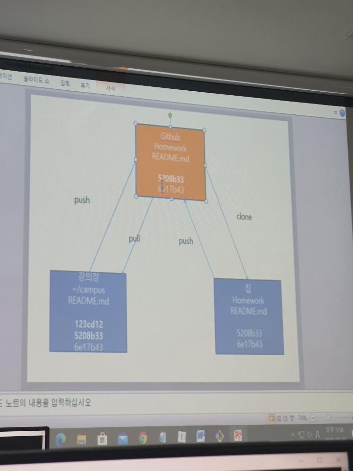

# Git 

> SCM (Source Code Management)  =  ''코드 관리 툴''
>
> VCS (Version Control System)  =  ''버전을 통한''


## Main Points

1. Git은 폴더 단위로 파일을 관리
2. 관리 관련 내용은 .git/ 폴더 안에 저장됨
3. git 상태 저장 == commit (사진찍기)
   1. 파일을 사진대 위에 올려놓기 == add (에 불과하다. commit을 최종적으로 해야지.)
   2. git status로 changes, untracked files 등 파악

```bash
$ git init
$ git status
$ git add markdown.md
$ git config --global user.email "ryudana@gmail.com"
$ git config --global user.name "Jiwon Yu"
$ git commit -m "first commit"
$ git log
$ git log --oneline

$ git diff --staged

$ git checkout (id)
```


## Github

> Local repository (~/git) --> Remote repository

```bash
$ git remote add 주소이름 주소URL
$ git remote add origin https://github.com/letsgititdana/gitbasic.git
$ git remote -v
origin  https://github.com/letsgititdana/gitbasic.git (fetch)
origin  https://github.com/letsgititdana/gitbasic.git (push)

$ git push origin master
```

- 주소이름을 보통 origin이라고 함. (왜?)


> Let's make campus <-> home environment through github

```bash
$ mkdir campus
$ cd campus
$ touch README.md
$ echo '# Homework' > README.md
$ cat README.md

# Step 1. Push (on the campus)
$ git init
$ git add README.md
$ git commit -m "first commit"
$ git log
$ git remote add origin https://github.com/letsgititdana/home_environment.git
$ git remote -v
$ git push origin master

# Step 2. Clone (at home, for once)
$ git clone https://github.com/letsgititdana/home_environment.git
$ cd home_environment
$ echo '## Homework done' > README.md
$ git add README.md

# Step 3. Push (at home)
$ git commit -m "Update READ.md"
$ git push origin master

# Step 4. Pull (on the campus)
$ git pull origin master

# Step 5. push on campus -> pull at home -> push at home -> pull on campus -> ...
```


## Github Collaborating

### (1) Push & Pull

- Git 협업 -> 독재 (무조건 contributor 초대가 필요함)

### (2) Fork & Pull Request

- 초대 필요 X -> 주로 Open source 프로젝트에 많이 쓰임
- 내 리포로 Fork 해온다음 다시 Push 하세요. 
- Original Repo에 구걸하세요. *"제발 내 repo를 pull 해 주세요..."*

### (3) Shared repository (branch and merge)

- 실제 현업에서 쓰임. 중요!!! 
- master branch에서 **절대. 직접.** 코딩하지 않는다!!

**Git Flow & Github Flow **

```bash
$ git branch slave1(name)
$ git branch
$ git checkout slave1
$ touch b.txt
$ git add .
$ git commit -m "Add b.txt"
$ git log --oneline
// 커밋 상태를 보면, slave1에는 b.txt가 있고 master에는 아직 없음!!! 
$ git checkout master
$ git branch -D slave1

$ git branch jiwon
$ git checkout jiwon
$ touch c.txt
$ git add .
$ git commit -m "Add c.txt"
$ git checkout master
$ git merge jiwon
// 이제 master에도 c.txt가 있다.
$ git branch -d jiwon


$ git push origin jiwon-branch
// 각자의 branch에 push해서 github에 branch 생성
// 그 다음 Pull request를 master로 보낸다.
// 그러면 이제 선임이 코드리뷰를 해서... 
```

- `checkout`은 과거를 보러갈때도, 다른 세계로 갈때도 쓰이네!
- `branch -d` 는 비어있는 branch 삭제, `branch -D`는 not fully merged branch 삭제.
- **branch 는 1회용이다!!!!!!!!!!!** *가지의 가지를 만들어라. 가지치기해라. 명심하자.* 


## Commit msg Conventions

( To be studied ... )


## Exercise

> 1.  01_Github_ITL.pdf 마크다운으로 변경 -> 02_git.md
>
> 2.  ~/TIL 생성 00.md 01.md 02.md 저장
>
> 3.  github TIL 저장소 생성 후 push
>
> 4. home_environment 에서 TIL 저장소 clone 후, README.md 수정해보기


